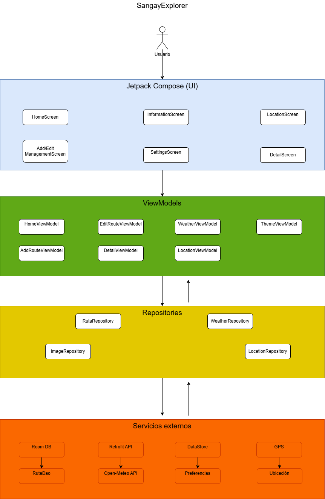
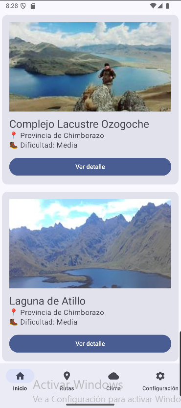
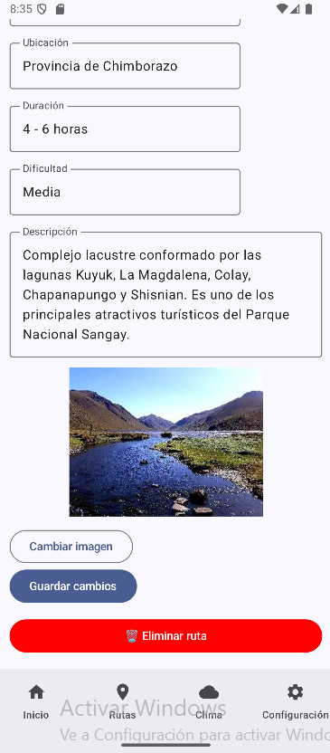
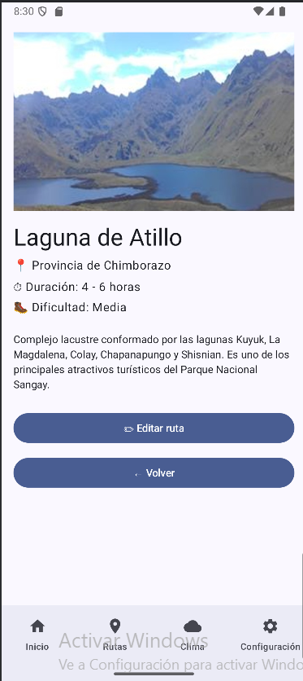
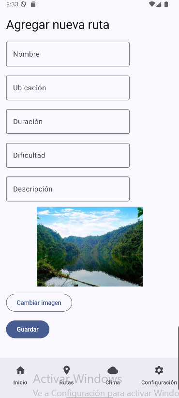
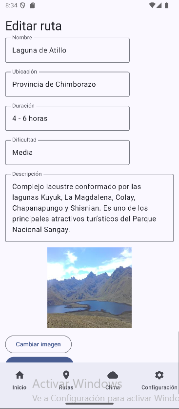
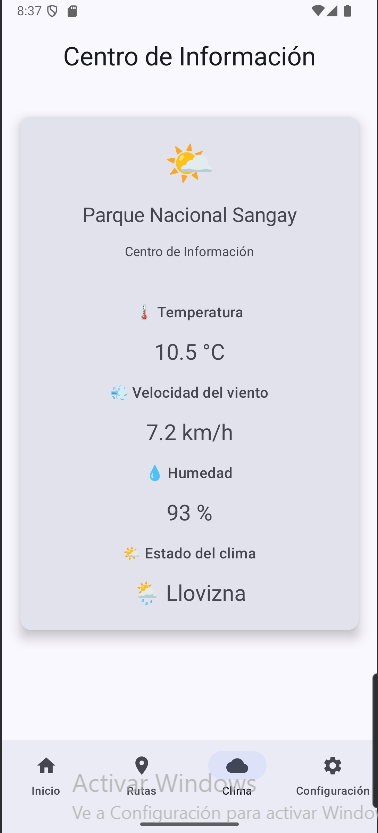
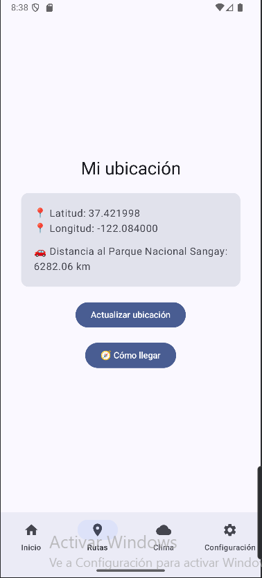
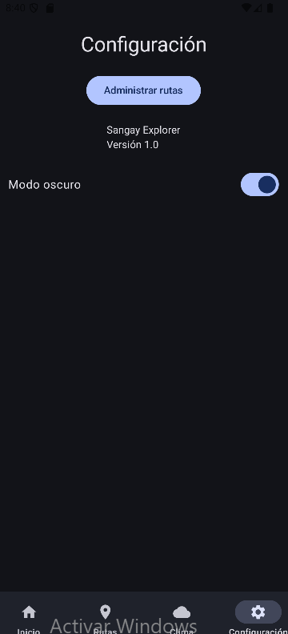

# SangayExplorer

## Descripción

SangayExplorer es una aplicación móvil desarrollada en Android Studio utilizando Kotlin y Jetpack Compose. Su objetivo es facilitar la consulta y gestión de rutas turísticas del Parque Nacional Sangay mediante una interfaz moderna, información climática en tiempo real y herramientas de ubicación.

---

## Objetivo

Desarrollar una aplicación móvil que permita administrar rutas turísticas y ofrecer información útil al visitante, integrando almacenamiento local, consumo de servicios web y funcionalidades del dispositivo móvil.

---

## Funcionalidades

- Gestión completa de rutas turísticas (Crear, Consultar, Editar y Eliminar).
- Visualización del detalle de cada ruta.
- Consulta del clima en tiempo real mediante Open-Meteo.
- Visualización de:
    - Temperatura
    - Velocidad del viento
    - Humedad
    - Estado del clima
- Obtención de la ubicación actual del usuario mediante GPS.
- Cálculo aproximado de la distancia hasta el Parque Nacional Sangay.
- Apertura de Google Maps para iniciar la navegación hacia el parque.
- Configuración del modo claro y oscuro persistente mediante DataStore.

---

## Arquitectura

El proyecto implementa la arquitectura MVVM (Model - ViewModel - View) junto con el patrón Repository para separar la lógica de negocio, la persistencia de datos y la interfaz de usuario.

---

## Tecnologías utilizadas

- Kotlin
- Jetpack Compose
- Material Design 3
- Navigation Compose
- Room Database
- Retrofit
- Open-Meteo API
- DataStore
- Coroutines
- StateFlow
- Google Play Services Location
- Coil

---

## API utilizada

Open-Meteo

Información consultada:

- Temperatura
- Velocidad del viento
- Humedad relativa
- Estado del clima

https://open-meteo.com/

---

## Persistencia

La aplicación utiliza:

- Room Database para almacenar las rutas turísticas.
- DataStore para almacenar la preferencia del tema (claro/oscuro).

---

## Funciones del dispositivo

La aplicación utiliza el GPS del dispositivo para:

- Obtener la ubicación actual del usuario.
- Calcular la distancia aproximada hasta el Parque Nacional Sangay.
- Abrir Google Maps para iniciar la navegación.

---

## Estructura general

UI (Jetpack Compose)

↓

ViewModel

↓

Repository

↓

Room
Retrofit
DataStore
GPS

---

# Arquitectura del proyecto

El proyecto sigue una arquitectura MVVM con separación entre la interfaz de usuario, ViewModels, repositorios, acceso a datos local y consumo de servicios REST.

  

---

# Capturas de la aplicación

## Pantalla principal

  

---

## Gestión de rutas

  

---

## Detalle de una ruta

  

---

## Agregar una ruta

  

---

## Editar una ruta

  

---

## Información climática

  

---

## Ubicación y navegación

  

---

## Configuración

  

## Autor

Juan Pablo Tene

Proyecto desarrollado para la asignatura de Aplicaciones Móviles.